# Concert Booking Assistant System

A modern, full-stack application for browsing concerts, booking tickets, and chatting with AI assistants for both users and administrators. This project is divided into a **React + Vite + Tailwind CSS** frontend and a **FastAPI + Supabase** backend, integrated with **n8n AI Agents** to automate chat, image uploading, and location enrichment workflows.

The system features an industry-grade, highly polished dark interface with glassmorphism layouts, micro-interactive transitions, geocoding lookups, and visual ticket stubs.

---

## System Architecture

```mermaid
graph TD
    %% Frontend Components
    subgraph Frontend [React + Vite + Tailwind]
        UI[User Interface]
        AdminUI[Admin Dashboard]
        APIC[API Client / lib/api.js]
        AdminAPIC[Admin API Client / lib/adminApi.js]
      style UI fill:#151320,stroke:#FF3D6E,stroke-width:2px;
      style AdminUI fill:#151320,stroke:#FFC857,stroke-width:2px;
    end

    %% Backend Components
    subgraph Backend [FastAPI Backend]
        F_API[FastAPI App / app/main.py]
        AuthRoute[Auth Routes]
        ConcertRoute[Concert Routes]
        BookingRoute[Booking Routes]
        WishlistRoute[Wishlist Routes]
        AdminRoute[Admin Routes]
        ChatRoute[Chat Route]
    end

    %% Database & External Integrations
    subgraph Infrastructure [Data & AI Layer]
        S_Auth[Supabase Auth]
        S_DB[(Supabase PostgreSQL)]
        S_Storage[Supabase Storage event-images]
        n8n_User[n8n User AI Agent Webhook]
        n8n_Admin[n8n Admin AI Agent Webhook]
        OSM_Geo[OSM Nominatim Geocoding]
    end

    %% Interactions
    UI --> APIC
    AdminUI --> AdminAPIC
    AdminUI -->|Address Search| OSM_Geo
    
    APIC -->|HTTP Request| F_API
    AdminAPIC -->|HTTP Request + Uploads| F_API

    F_API --> AuthRoute
    F_API --> ConcertRoute
    F_API --> BookingRoute
    F_API --> WishlistRoute
    F_API --> AdminRoute
    F_API --> ChatRoute

    %% Backend to Infra
    AuthRoute -->|Verify Token / Signin| S_Auth
    BookingRoute -->|CRUD bookings, payments + Join Events| S_DB
    ConcertRoute -->|Query events, tickets| S_DB
    WishlistRoute -->|Manage wishlists| S_DB
    AdminRoute -->|Create Event / Update pricing| S_DB
    AdminRoute -->|Upload poster images| S_Storage
    
    %% Backend to n8n Webhooks
    ChatRoute -->|Forward user_id & message| n8n_User
    AdminRoute -->|Forward admin_user_id, image URL, lat/lng| n8n_Admin
```



---

## Directory Structure

```text
Concert System/
├── README.md                 # Root documentation (this file)
├── concert_frontend/         # React, Vite, and Tailwind CSS frontend application
│   ├── src/
│   │   ├── components/       # Reusable UI components (NavBar, ConcertCard)
│   │   ├── pages/            # Page components (Home, Concert Detail, Bookings, Chat, Admin)
│   │   ├── lib/              # API clients (api.js, adminApi.js)
│   │   ├── App.jsx           # Main application routing and shell
│   │   └── main.jsx          # Vite React entry point
│   ├── package.json
│   └── tailwind.config.js
└── concert_backend/          # FastAPI and Supabase Python backend application
    ├── app/
    │   ├── routes/           # Endpoint handlers (auth, booking, admin, chat, concerts)
    │   ├── admin_auth.py     # Admin authorization middleware
    │   ├── auth.py           # JWT token verification using Supabase Auth
    │   ├── config.py         # Environment configuration loading
    │   ├── main.py           # FastAPI server entry point
    │   └── supabase_client.py# Supabase Admin and Anon client initialization
    ├── requirements.txt      # Python dependencies
    └── .env.example          # Sample environment variables configuration
```

---

## Setup & Running Locally

Follow the instructions below to get both parts of the application running locally.

### Prerequisites
* **Node.js** (v18 or higher recommended)
* **Python** (v3.10 or higher recommended)
* **Supabase Account** with database tables and an `event-images` storage bucket set up.
* **n8n Account** (cloud or self-hosted) with active workflows for User and Admin chat.

---

### 1. Backend Setup (`concert_backend`)

1. **Navigate to the backend folder**:
   ```bash
   cd concert_backend
   ```

2. **Create a virtual environment and install dependencies**:
   * **Windows (PowerShell)**:
     ```powershell
     python -m venv venv
     .\venv\Scripts\Activate.ps1
     pip install -r requirements.txt
     ```
   * **Mac/Linux**:
     ```bash
     python3 -m venv venv
     source venv/bin/activate
     pip install -r requirements.txt
     ```

3. **Configure environment variables**:
   Create a `.env` file by copying the example:
   ```bash
   cp .env.example .env
   ```
   Fill in your specific Supabase credentials and n8n webhook URLs:
   ```ini
   SUPABASE_URL=https://your-project-id.supabase.co
   SUPABASE_ANON_KEY=your-supabase-anon-key
   SUPABASE_SERVICE_ROLE_KEY=your-supabase-service-role-key
   N8N_WEBHOOK_URL=https://your-n8n-instance/webhook/user-agent
   N8N_ADMIN_WEBHOOK_URL=https://your-n8n-instance/webhook/admin-agent
   ```
   * *Note*: Make sure your n8n webhook URLs are the **production** ones (without `-test` in the path) and that the n8n workflows are active.

4. **Run the FastAPI server**:
   ```bash
   uvicorn app.main:app --reload
   ```
   The backend will run on `http://127.0.0.1:8000`. You can access interactive Swagger docs at `http://127.0.0.1:8000/docs`.

---

### 2. Frontend Setup (`concert_frontend`)

1. **Navigate to the frontend folder**:
   ```bash
   cd ../concert_frontend
   ```

2. **Install node dependencies**:
   ```bash
   npm install
   ```

3. **Configure environment variables (optional)**:
   Create a `.env` file or define variables if you wish to override the default local backend port:
   ```bash
   cp .env.example .env
   ```
   Provide the URL where your FastAPI backend is running:
   ```ini
   VITE_API_URL=http://127.0.0.1:8000
   ```

4. **Start the development server**:
   ```bash
   npm run dev
   ```
   Open `http://localhost:5173` in your browser to interact with the application.

---

## Detailed Component Review

### 1. Visual Aesthetics & Token System
The frontend implements a unified design system with core variables for a premium, industry-grade appearance:
*   **Glassmorphism Layouts**: Custom `.glass-card` utilities combine subtle transparency and backdrop blurring to overlay panels over mesh radial gradients.
*   **Fluid Transitions & Animations**: Page transitions feature `fade-in-up` entry slides. Cards have interactive scales, and custom scrollbars are styled with hot-magenta highlight indicators.

### 2. Authentication Flow
*   **Login/Signup**: The frontend calls the backend `/auth/signup` and `/auth/login` endpoints. The backend uses the Supabase python SDK to verify credentials, generating a JWT token and returning user details (such as the database user ID).
*   **JWT Token Verification**: Protected endpoints verify client authenticity via the `Authorization: Bearer <token>` header, decoding the JWT via `supabase_admin.auth.get_user(token)`.
*   **Admin Verification**: Admin endpoints (`/admin/*`) additionally query the `users` table to verify if the `is_admin` column is set to `true` for the authenticated user, securing administrative functions on the backend.
*   **Avatars**: The navigation bar displays user initials inside dynamic gradient badges with drop-down sheets for profile config and secure logouts.

### 3. Booking Workflow & Enhanced Joins
*   **Availability Checks**: Direct API bookings are executed fast and transactionally. The backend checks remaining seat quantities for a concert ticket category in the database before completing bookings.
*   **Transactional Seat Reductions**: Bookings decrement the database `available_seats` record dynamically. Canceling bookings updates the status to `Cancelled`, and seat restoration is performed automatically using Postgres database triggers.
*   **Simulated Payments**: Payments are handled locally with dummy transaction record creation, finalizing booking status to `Confirmed`.
*   **Relational Joins**: The backend endpoints `my_bookings` (`GET /bookings/me`) and `list_all_bookings` (`GET /admin/bookings`) execute joins (`select("*, events(*)")`) to retrieve artist name, venue details, and poster images.
*   **Physical Ticket Stubs**: The booking history page converts raw booking rows into visual ticket passes with barcode representations, side notch cutouts (`.ticket-cutout-left`), and details.

### 4. Interactive Booking & Checkouts
*   **Dual-Column Layout**: Detail screens list show information on the left and pricing categories, booking inputs, and checkouts on the right.
*   **Visual Card Preview**: Selecting a credit card payment renders an interactive mockup credit card widget that displays numbers, expiry dates, and CVVs dynamically as the user types.
*   **Done Stubs**: Successful payments generate a ticket stub invoice pass ready for download or view.

### 5. AI Agent Integration (via n8n)
*   **User Assistant (`/chat`)**: Allows users to find upcoming events, ask booking questions, and manage their reservations. The message, user's authenticated ID, and browser tab session UUID are forwarded to n8n for conversation memory maintenance. The interface is styled as a chatbot stream with rounded user/bot bubbles and custom bouncy loading dots.
*   **Admin Assistant (`/admin/agent-chat`)**: Supports uploading images (such as event flyers) which are automatically hosted on the Supabase storage bucket `event-images` prior to forwarding the generated public URL inside the n8n message payload. If a location is provided (latitude/longitude), the backend passes it along to allow the n8n workflow to update event details or enrich data using geographical lookups.
*   **OSM Nominatim Geocoder**: The admin panel features address autocompleting queries directly contacting OpenStreetMap's geocoding server to find venue names and map coordinates for pinning.
